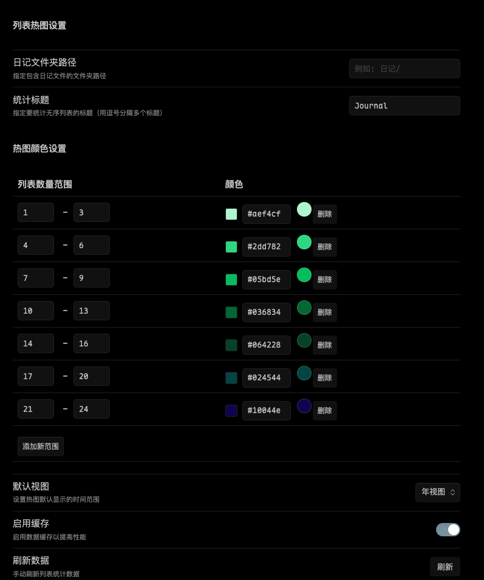

# Obsidian List Heatmap Plugin

An Obsidian plugin that counts unordered list items under specific headings in daily notes and displays them in GitHub-style heatmap in the sidebar.

> [!TIP]
> This plugin was developed by LLM. Any issues can be fixed by LLM.

## Features

- Counts unordered list items under user-defined headings in daily notes (YYYY-MM-DD format)
- Visualizes statistics in GitHub-style heatmap in the sidebar panel
- Supports both year view and month view
- Customizable heatmap color ranges
- Data persistence with local caching
- Manual refresh functionality
- Automatically clears cache when path or headings are changed

## Installation

### Manual Installation

1. Download the latest release package
2. Extract the downloaded file
3. Copy the extracted folder to Obsidian plugins directory (`.obsidian/plugins/`)
4. Enable the plugin in Obsidian

### Via BRAT

1. Install [BRAT](https://github.com/TfTHacker/obsidian42-brat) plugin
2. Add this repository URL in BRAT settings
3. Enable the plugin in Obsidian

## Usage

1. After installation, a calendar icon will appear in the right sidebar
2. Click the icon to open the list heatmap panel
3. Configure diary folder path and headings to count in plugin settings
4. The heatmap will automatically show daily unordered list counts

## Configuration

- **Diary folder path**: Specify the folder path containing diary files
- **Count headings**: Specify headings to count unordered lists under (comma separated)
- **Heatmap color settings**: Customize heatmap color ranges
- **Default view**: Set default time range for heatmap display (year or month view)
- **Enable cache**: Enable data caching for better performance

## Development

### Prerequisites

- [Node.js](https://nodejs.org/)
- [pnpm](https://pnpm.io/) (recommended) or npm

### Local Development

1. Clone this repository
2. Install dependencies: `pnpm install` or `npm install`
3. Build plugin: `pnpm build` or `npm run build`
4. Development mode: `pnpm dev` or `npm run dev`

## License

[MIT](LICENSE)
