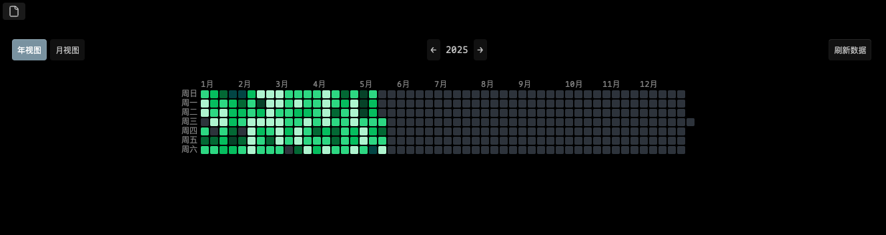

# Obsidian List Heatmap Plugin
[中文文档](README_zh.md)

This is an Obsidian plugin that counts unordered lists under specific headings in diary files and displays the data as a GitHub-style heatmap in the sidebar panel.



> [!TIP]
> This plugin was developed with the help of an LLM. Any issues encountered during use can be resolved with assistance from the LLM.

## Features

- Count unordered lists under user-defined headings in diary files (YYYY-MM-DD format)
- Display the data as a GitHub-style heatmap in the sidebar panel
- Support both year and month views
- Customize heatmap colors based on list count ranges
- Data caching for improved performance
- Manual refresh option
- Click on heatmap cells to open the corresponding diary file
- Hover over cells to see file details and list counts

## Installation

1. Download the latest release from the Releases section
2. Extract the zip file into your Obsidian plugins folder: `{vault}/.obsidian/plugins/`
3. Enable the plugin in Obsidian settings

## Usage

1. After enabling the plugin, click the calendar icon in the ribbon to open the heatmap panel
2. Configure the plugin settings:
   - Set the diary folder path
   - Define the headings under which to count lists
   - Customize color ranges
   - Choose default view (year or month)

## Settings

- **Diary Folder Path**: Path to the folder containing your diary files
- **Count Titles**: Headings under which to count unordered lists (comma-separated)
- **Heatmap Color Settings**: Define color ranges for different list counts
- **Default View**: Choose between year and month view
- **Enable Cache**: Toggle data caching for improved performance

## Development

### Prerequisites

- Node.js and npm

### Building the plugin

1. Clone this repository
2. Install dependencies: `npm install`
```
npm install
npm install --save-dev esbuild@0.14.0 esbuild-plugin-copy@latest
npm install --save-dev typescript@4.9.5
```
3. Build the plugin: `npm run build`

## License

This project is licensed under the MIT License - see the LICENSE file for details.

## Acknowledgements

- Inspired by GitHub's contribution heatmap
- Built for Obsidian (https://obsidian.md)

## Support

If you encounter any issues or have suggestions for improvements, please open an issue on the GitHub repository.
